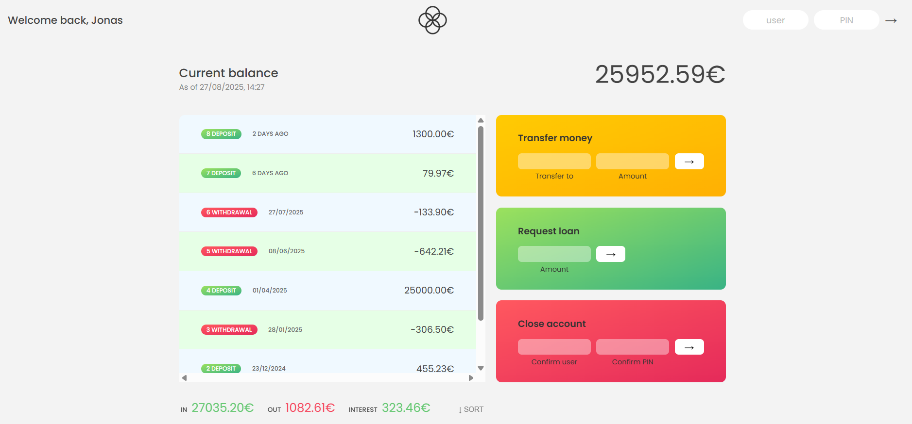

# 💰 Bankist App

A simple banking application built with **HTML, CSS, and JavaScript**.  
This project simulates real-world banking operations like viewing transactions, transferring money, requesting loans, and closing accounts.  

---

## 🚀 Features
- 🔑 **Login** with username & PIN  
- 📜 **View transaction history** (deposits & withdrawals)  
- 💳 **Transfer money** between accounts  
- 🏦 **Request a loan** (approved if at least one deposit ≥ 10% of the loan)  
- ❌ **Close account** securely  
- 📊 **Account summary** showing:
  - Total income
  - Total outgoing
  - Interest earned  
- 🔄 **Sort transactions** (ascending/descending)  
- 🎨 Responsive UI for a clean banking experience  

---

## 🛠️ Tech Stack
- **HTML5**  
- **CSS3**  
- **Vanilla JavaScript (ES6+)**  

---

## 🧑‍💻 How to Run
1. Clone this repository:
   ```bash
   git clone https://github.com/<your-username>/<repo-name>.git
2. Open index.html in your browser

---

## 🔑 Test Accounts
- **Use the following demo accounts to log in:**
- **User 1**
  - Username: js
  - PIN: 1111
- **User 2**
  - Username: jd
  - PIN: 2222
- **User 3**
  - Username: stw
  - PIN: 3333
- **User 4**
  - Username: ss
  - PIN: 4444

---

## 📸 Preview




## 📌 Learning Outcome

**This project helped me practice:**
- Array methods (map, filter, reduce, find, forEach, etc.)
- DOM manipulation
- Event handling
- Implementing real-world features in JS

---

## 📜 License

This project is for learning purposes only. Not a real banking application.
